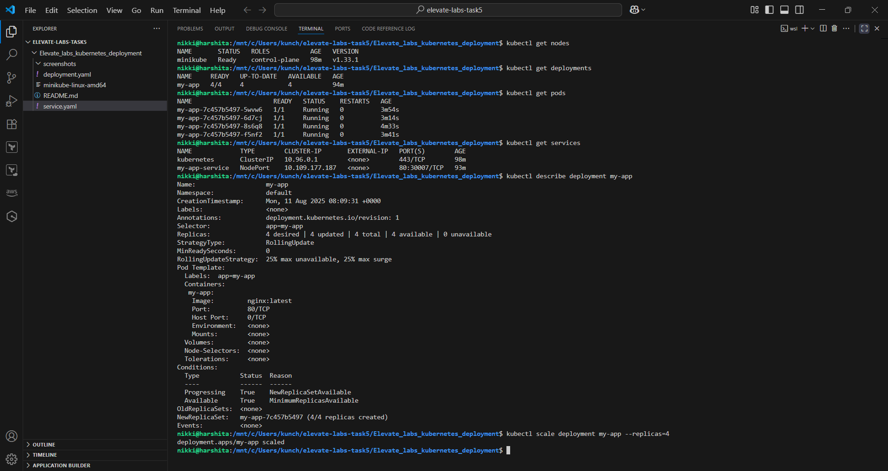
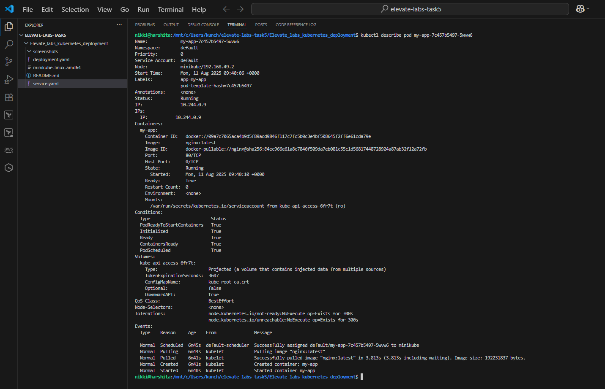
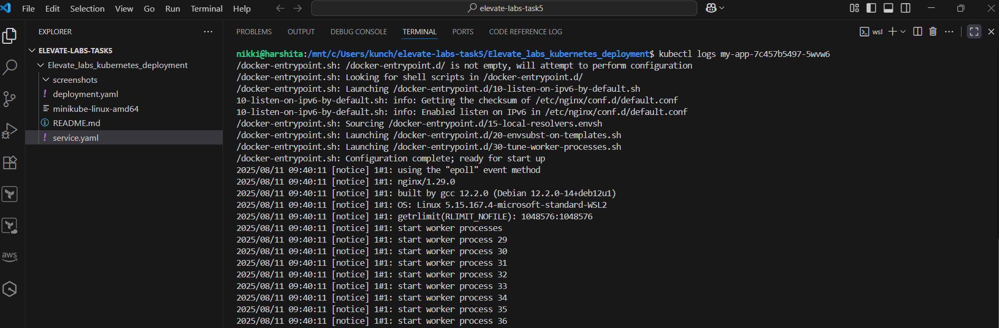

# 🚀 App Deployment in Kubernetes

## Objective

Deploy a simple **Nginx application** in a Kubernetes cluster locally using **Minikube**. Learn how to manage Kubernetes resources like deployments and services, scale applications, and verify resource states using `kubectl`.

---

## 🛠️ Tools Used

- **Minikube**: Local Kubernetes cluster
- **kubectl**: Kubernetes command-line tool
- **Docker**: Container runtime for Minikube

---

## 📝 Steps Performed

### 1️⃣ Install Minikube and Start the Cluster

## Installed Minikube and kubectl on Ubuntu:
```
curl -LO https://storage.googleapis.com/minikube/releases/latest/minikube-linux-amd64
sudo install minikube-linux-amd64 /usr/local/bin/minikube

snap install kubectl or apt install -y kubectl

```
# Start a MINIKUBE local cluster:
`minikube start --driver=docker`

```bash
minikube start
kubectl get nodes
````

---

### 2️⃣ Created Deployment (`deployment.yaml`)

```yaml
apiVersion: apps/v1
kind: Deployment
metadata:
  name: my-app
spec:
  replicas: 2
  selector:
    matchLabels:
      app: my-app
  template:
    metadata:
      labels:
        app: my-app
    spec:
      containers:
      - name: my-app
        image: nginx:latest
        ports:
        - containerPort: 80
```

- Applied the deployment:

```bash
kubectl apply -f deployment.yaml
```

---

### 3️⃣ Exposed the App with a Service (`service.yaml`)

```yaml
apiVersion: v1
kind: Service
metadata:
  name: my-app-service
spec:
  type: NodePort
  selector:
    app: my-app
  ports:
  - protocol: TCP
    port: 80
    targetPort: 80
    nodePort: 30007
```

- Applied the service:

```bash
kubectl apply -f service.yaml
```

---

### 4️⃣ Verified Resources

- Checked pods, deployments, and services:

```bash
kubectl get nodes
kubectl get pods
kubectl get deployments
kubectl get services
```

- Described resources for details:

```bash
kubectl describe deployment my-app
kubectl describe service my-app-service
```

---

### 5️⃣ Scaled the Deployment

- Scaled the Nginx deployment to 4 replicas:

```bash
kubectl scale deployment my-app --replicas=4
kubectl get pods
```

---

### Accessing the Service 
 After applying the service.yaml, run:

 ```
 minikube service my-app-service
 ```
 This command will automatically open the application in your default browser.
 In this setup, I accessed it locally using `firefox`

 If in case browser is not available in your local Ubuntu machine , you can download using a command:
 
 ```
 apt get update
 apt install -y firefox
 ```
 Example Output:
|-----------|-----------------|-------------|---------------------------|
| NAMESPACE |      NAME       | TARGET PORT |            URL            |
|-----------|-----------------|-------------|---------------------------|
| default   | my-app-service  |          80 | http://192.168.49.2:30007 |
|-----------|-----------------|-------------|---------------------------|

### 6️⃣ Checked Logs

- Fetched logs from a running Nginx pod:

```bash
kubectl logs <pod_name>
```

---

## 📸 Screenshots

- All-in-One Screenshot (Kubernetes Commands and Outputs)



- verifying `kubectl describe` command



- verifying `kubectl logs` command



- A video showing Service is accessible on browser


---

## 💡 Kubernetes Concepts Learned

| Concept                               | Description                                                                                |
| ------------------------------------- | ------------------------------------------------------------------------------------------ |
| **Kubernetes**                        | Container orchestration platform for managing containers at scale.                         |
| **kubelet**                           | Agent running on each node to manage pods and containers.                                  |
| **Pods**                              | Smallest deployable unit in Kubernetes, wrapping one or more containers.                   |
| **Deployments**                       | Manage the desired state of pods (replicas, updates, etc.).                                |
| **Services**                          | Abstracts and exposes pods as a network service (e.g., ClusterIP, NodePort, LoadBalancer). |
| **Scaling**                           | Adjust the number of replicas in a deployment using `kubectl scale`.                       |
| **Namespaces**                        | Logical partitions for isolating Kubernetes resources.                                     |
| **ClusterIP, NodePort, LoadBalancer** | Service types for different levels of access.                                              |
| **ConfigMaps**                        | Stores non-sensitive configuration data as key-value pairs.                                |
| **Rolling Updates**                   | Gradually replaces pods during updates without downtime.                                   |

---

## 📂 Project Structure

```
.
Elevate_labs_kubernetes_deployment/
├── deployment.yaml
├── service.yaml
├── screenshots/
│   |── all_kubectl_commands.png
|   |── kubectl_describe.png
|   |── kubectl_logs.png
|   |── service_running_browser.mp4
└── README.md
```

---

## 📚 References

* [Kubernetes Official Documentation](https://kubernetes.io/docs/home/)
* [Minikube Documentation](https://minikube.sigs.k8s.io/docs/)

---

## ✍️ Author

**Nikki Goyal**

---